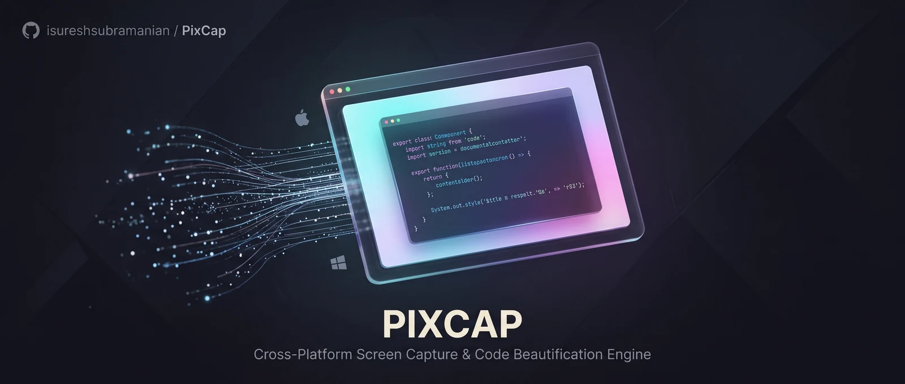

<div align="center">



<br>

**Capture, annotate, and beautify screenshots on macOS and Windows.**

Two native apps over one shared Rust core. Nothing leaves your machine.

[](LICENSE)
[](#installing)
[](https://www.rust-lang.org)
[](https://pixcap.app)

</div>

---

## What it is

Screenshot tools usually stop at the capture. The work after it — marking up
what matters, hiding what shouldn't be shared, and framing the result so it
reads well in a pull request or a deck — is where the time actually goes.
PixCap does that part.

It runs entirely on your machine. There is no account, no telemetry, and no
server to upload to, because there is no server.

## Features

| | macOS | Windows |
|:--|:--:|:--:|
| Region, window, and display capture | ● | ● |
| Annotation editor — 13 tools, non-destructive, full undo | ● | ● |
| Beautification — backgrounds, padding, shadow, window frame | ● | ● |
| Redaction — blur, pixelate, or an opaque block | ● | ● |
| Code snippets — 66 languages, 7 themes, PNG or SVG | ● | ● |
| History with full-text search | ● | ● |
| Tray / menu-bar icon, start at login | ● | ● |
| Global shortcuts | ● | ◐ &nbsp;area capture only |
| Scrolling capture, stitched by matching overlapping rows | ● | ◐ &nbsp;core ready, no UI |
| On-device OCR, so old captures are findable by what they say | ● | ○ |
| Screen recording to MP4 and GIF | ● | ○ |
| Pin a capture on top of the screen | ● | ○ |
| Quick Access overlay | ● | ○ |

<sub>● shipped &nbsp;·&nbsp; ◐ partial &nbsp;·&nbsp; ○ not yet</sub>

The Windows app is younger than the macOS one and that table is honest about
it. Everything below the line is tracked in
[`platforms/windows/TASKS.md`](platforms/windows/TASKS.md).

Annotations live in a `.pixcap.json` sidecar rather than being flattened into
the image, so a capture can be reopened and re-edited long after it was taken.

**When you export, copy, share, or pin, the image is flattened** — annotations
and redactions are composited into the pixels, and the original is not
recoverable from the result.

**Save editable copy** is the one exception, by design: it writes the untouched
source beside a sidecar so the session can be resumed later. That file is for
you, not for sending, so the app says so before writing it and offers to export
a flattened image instead.

Text extraction respects redactions too. OCR runs on the source, for accuracy,
so it does see what is underneath a blur — any line a concealing annotation
covers is dropped before it reaches the clipboard.

## Installing

Download from **[pixcap.app](https://pixcap.app)**, or grab a build from
[Releases](https://github.com/isureshsubramanian/PixCap/releases).

- **macOS** — 14 or newer, Apple silicon and Intel. Signed and notarised.
- **Windows** — 10 version 1903 or newer, x64 and ARM64.

## How it is put together

```
crates/
  pixcap-core     rendering, scroll stitching, redaction, OCR index, history
  pixcap-ffi      C ABI — consumed by Swift on macOS, C# on Windows
  pixcap-ipc      local transport: Unix socket on macOS, named pipe on Windows
  pixcap-cli      headless rendering
platforms/
  macos           Swift, SwiftUI/AppKit, ScreenCaptureKit, Core Graphics
  windows         C# on .NET 8, WinUI 3, Windows.Graphics.Capture
extensions/
  vscode          VS Code extension (TypeScript)
  jetbrains       JetBrains plugin (Kotlin)
```

### Two renderers, deliberately

macOS draws through Core Graphics. Windows and the CLI draw through the
`tiny-skia` renderer in `pixcap-core`. That is a choice, not duplicated effort:
each app renders with the framework native to its platform, so each one behaves
the way its users expect rather than like a port.

What keeps them honest is the shared `AnnotationDocument` schema. Both
renderers read the same field definitions, so the same document yields the same
layout on either platform. The contract lives in the data, not in shared
drawing code — which means a new feature is added once, to the schema, and each
renderer implements it natively.

Everything that isn't drawing is shared outright: background presets, file
naming, the history database, syntax highlighting, and redaction all run in
Rust behind the same C ABI on both platforms.

## Building

Rust 1.85 or newer, plus Xcode Command Line Tools and Swift 6 for macOS, or
Visual Studio 2022 with the Windows App SDK for Windows.

```bash
cargo build --workspace
cargo test  --workspace     # 48 tests
```

Then the platform app:

```bash
# macOS — produces PixCap.app
./platforms/macos/PixCapMac/scripts/make-app.sh

# Windows — add -Installer to also produce setup.exe
./platforms/windows/build.ps1
```

Signing is optional and off by default; the macOS build falls back to an ad-hoc
signature that works locally. To sign properly, copy
`platforms/macos/PixCapMac/scripts/signing.env.example` to `signing.env` and
fill it in. Notarisation credentials live in the Keychain, never in that file.

[`platforms/windows/README.md`](platforms/windows/README.md) covers the Windows
build in more depth, including the parts that are not implemented there yet and
why some of the shell is Windows Forms rather than WinUI.

## Contributing

Issues and pull requests are welcome. Two things worth knowing before you start:

- **Changes to `crates/` reach both apps.** Adding functions, FFI entry points,
  or fields with `serde` defaults is safe. Changing behaviour that macOS
  already depends on is not.
- **Verify by running it.** A clean build is not evidence — most of the bugs
  recorded in `platforms/windows/TASKS.md` compiled perfectly and were still
  wrong at runtime.

## Licence

Apache License 2.0 — see [LICENSE](LICENSE). It includes an express patent
grant, which a permissive MIT licence does not.
